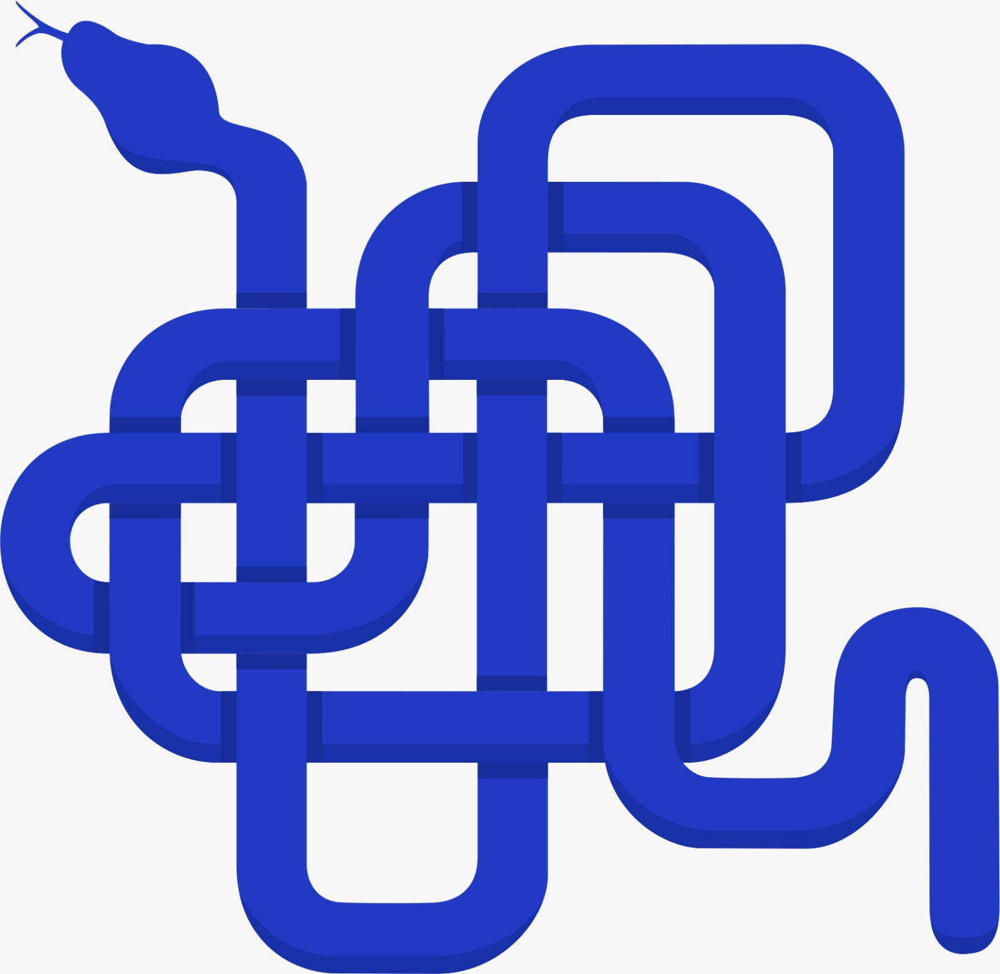

<h1> 🐍 O JEITO MAIS RÁPIDO DE CONECTAR O CIDADÃO COM A PREFEITURA - JAVA.PY 🐍 </h1>


<p>
  
</p>


## Proposta

Como o cidadão pode ajudar na zeladoria pública de sua cidade?

## Objetivo do projeto

Um dos desafios enfrentados pelas prefeituras é garantir que os cidadãos possam participar de forma ativa e efetiva na zeladoria da cidade. Para solucionar esse problema e facilitar a comunicação entre a população e o poder público, foi desenvolvido um site que funciona como uma plataforma de sugestões, reclamações e elogios.

O objetivo principal do site é oferecer aos cidadãos um canal direto de comunicação com a prefeitura, permitindo que possam expressar suas opiniões sobre a qualidade dos serviços oferecidos e das condições dos espaços públicos. Ao permitir que os cidadãos possam fazer suas sugestões, reclamações e elogios de forma rápida e fácil, o site se torna uma ferramenta valiosa para o poder público, pois permite que os gestores possam identificar os problemas que afetam a cidade e, assim, trabalhar para resolvê-los de forma mais eficiente.

## Demonstração da Aplicação

'gif da aplicação aqui'

## 🛠️ Instalação 🛠️

- Clone este repositório em sua máquina local.
- Copy code
```bash
$ git clone https://github.com/more-devs-2-blu/java.py.git
```
- Crie um virtualenv e ative-o.
```bash
$ python -m venv venv
```
```bash
$ venv\Script\activate
```
- Instale as dependências listadas no arquivo requirements.txt usando o comando:
```bash
$ pip install -r requirements.txt
```
- Migrations:
```bash
$ python manage.py makemigrations
```
```bash
$ python manage.py migrate
```
Inicie o servidor:
```bash
$ python manage.py runserver
```


## ✒️ Equipe


| Alunos                              | Função                      |  Github                                       | 
| ----------------------------------- | --------------------------- | --------------------------------------------- |
| David                               | Back-end                    |  [Github](https://github.com/davidsimas)       |
| Everton                             | Back-end                   | [Github](https://github.com/EvertonDenega)    |
| Guilherme                           | Front-end          | [Github](https://github.com/guiwamser)     |
| João                                | Arquiteto de software     | [Github](https://github.com/JoaoCasali)   |
| Larissa                          | Gerente de projetos                    | [Github](https://github.com/lsebold) |
| Luiza                              |  UX/UI e Front-end                   | [Github](https://github.com/LuizaBissoni)        |


## 📄 Licença

[MIT](https://choosealicense.com/licenses/mit/)

[](https://choosealicense.com/licenses/mit/) 
[](https://opensource.org/licenses/)
[](http://www.gnu.org/licenses/agpl-3.0)

## 🎁 Agradecimentos

* O time foi agil e preciso.
* Obrigado ao instrutor Andre Vitor Granemann.
